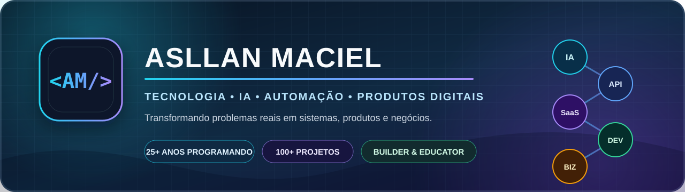

  

  
  
  

<h2 align="center">Senior PHP, Laravel & WordPress Engineer · AI Engineering</h2>

  I build and modernize business-critical software, developer tooling and AI-assisted systems. 
  Senior judgment, pragmatic delivery, open-source contribution and async-friendly collaboration.

<table align="center">
  <tr>
    <td align="center"><strong>25+</strong> years in software</td>
    <td align="center"><strong>15+</strong> years with WordPress</td>
    <td align="center"><strong>100+</strong> projects delivered</td>
    <td align="center"><strong>OSS</strong> WordPress & WooCommerce</td>
  </tr>
</table>

## What I work on

<table>
  <tr>
    <td width="50%" valign="top">
      <h3>PHP & Laravel applications</h3>
      
Architecture, legacy modernization, APIs, integrations, performance, security and maintainability for business-critical products.

    </td>
    <td width="50%" valign="top">
      <h3>WordPress & WooCommerce engineering</h3>
      
Custom plugins, complex integrations, performance, developer tooling and contributions to the wider ecosystem.

    </td>
  </tr>
  <tr>
    <td width="50%" valign="top">
      <h3>SaaS & product architecture</h3>
      
Multi-tenant platforms, billing, queues, webhooks, observability, CRM workflows and operational tooling.

    </td>
    <td width="50%" valign="top">
      <h3>AI engineering & automation</h3>
      
LLM integrations, agent orchestration, AI-assisted development workflows, automation and developer infrastructure.

    </td>
  </tr>
</table>

> Most client and commercial product code is private by design. Public repositories focus on reusable tools, architecture references, educational projects and community contributions.

## Current focus

- AI-assisted software engineering and agent orchestration.
- Developer tooling for PHP, WordPress and GitHub workflows.
- Practical SaaS architecture: tenancy, billing, queues, webhooks and observability.
- Open-source contributions to WordPress and WooCommerce.

## Open-source highlights

I also maintain **[WP24Horas Open Source](https://github.com/WP24Horas)**, a developer-focused home for WordPress tooling, architecture references and practical examples.

**[View the dedicated open-source portfolio →](OPEN_SOURCE.md)**

- **[WP24H Plugin Boilerplate](https://github.com/WP24Horas/wp24h-plugin-boilerplate):** modular WordPress plugin starter with safe scaffolding, module generation, REST examples, tests, static analysis and verified release tooling.
- **[WP24H MD Importer](https://github.com/asllanmaciel/wp24h-md-importer):** Markdown + front matter importer with taxonomy, SEO metadata, featured images and optional authenticated REST automation.
- **[Laravel SaaS Blueprint](https://github.com/asllanmaciel/laravel-saas-blueprint):** practical architecture guidance for tenancy, billing, security, jobs, webhooks and observability.
- **[WP Plugin README Validator](https://github.com/asllanmaciel/wp-plugin-readme-validator):** dependency-free CLI and GitHub Action for validating WordPress plugin metadata.
- **[GitHub Webhook Security Guide](https://github.com/asllanmaciel/github-webhook-security-guide):** tested PHP and Node.js examples for validating webhook signatures with HMAC SHA-256.
- **[BIBLIAAPI Examples](https://github.com/asllanmaciel/bibliaapi-examples):** secure cURL, PHP and JavaScript integration examples using tokens and environment variables.

## Community contributions

- **[WordPress Presence API — PR #193](https://github.com/WordPress/presence-api/pull/193):** merged contribution improving database portability by removing MySQL session mutations and replacing GROUP_CONCAT aggregation with deterministic PHP aggregation and regression coverage.
- **[WooCommerce — PR #67645](https://github.com/woocommerce/woocommerce/pull/67645):** active contribution adding bulk Activate, Pause and Deactivate webhook actions with status persistence, notices, initial-ping parity and end-to-end coverage.

## Selected products

### [GHDevLog](https://ghdevlog.com)
Developer intelligence for receiving, validating and investigating GitHub webhooks with security and traceability.  
`GitHub` `Webhooks` `Security` `AI`

### [BIBLIAAPI](https://bibliaapi.com.br)
API-first infrastructure for Bible applications, including REST APIs, WordPress integrations, mobile clients and SaaS capabilities.  
`Laravel` `REST API` `WordPress` `Mobile`

### [ClariDados](https://claridados.com.br)
Privacy-conscious analytics for tracking visits, acquisition sources, pages and conversions without unnecessary complexity.  
`Analytics` `Privacy` `Reporting` `APIs`

### [Cresça na Fé](https://crescanafe.com)
A content platform with studies, devotionals and resources supported by a long-running WordPress publishing ecosystem.  
`WordPress` `Content Platform` `SEO`

## Core stack

  
  
  
  
  
  
  
  

## How I work

- **Business context first:** understand the operational problem before choosing a tool.
- **Incremental delivery:** reduce risk through focused, observable improvements.
- **Production-minded engineering:** security, tests, documentation, observability and recovery matter.
- **Clear written communication:** decisions, tradeoffs and next steps are documented.
- **Async by default:** we can start by email and only schedule a call when it is genuinely useful.

---

  <strong>Need senior help with a PHP, Laravel, WordPress or AI-enabled product?</strong>  
  <a href="https://asllanmaciel.com.br/start-a-project/"><strong>Send your project details</strong></a>
  ·
  <a href="https://asllanmaciel.com.br/software-consulting/">View the international portfolio</a>

