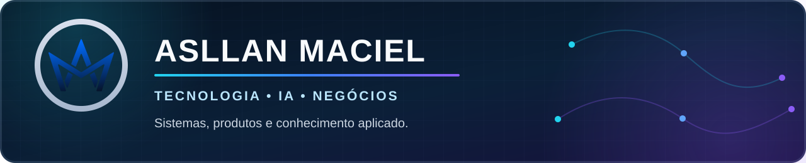

  

  
  
  
  

  Construo sistemas próprios e para clientes, aplico IA e automação a problemas reais 
  e transformo experiência prática em produtos, mentoria, cursos e ferramentas.

<table align="center">
  <tr>
    <td align="center"><strong>25+</strong> anos construindo</td>
    <td align="center"><strong>Sistemas</strong> próprios e para clientes</td>
    <td align="center"><strong>IA</strong> aplicada à execução</td>
    <td align="center"><strong>Conhecimento</strong> prático e compartilhado</td>
  </tr>
</table>

## O que eu construo

<table>
  <tr>
    <td width="50%" valign="top">
      <h3>Produtos e sistemas próprios</h3>
      
SaaS, APIs, plataformas, ferramentas e operações digitais que evoluem com uso real.

    </td>
    <td width="50%" valign="top">
      <h3>Sistemas para clientes</h3>
      
Arquitetura, desenvolvimento, modernização, integrações e automações para necessidades concretas.

    </td>
  </tr>
  <tr>
    <td width="50%" valign="top">
      <h3>IA e automação</h3>
      
Agentes, MCPs, workflows e integrações que ampliam capacidade sem abrir mão de segurança e supervisão.

    </td>
    <td width="50%" valign="top">
      <h3>Cursos e mentoria</h3>
      
Experiência de mercado transformada em projetos, formação prática e direção para carreira, produto e negócio.

    </td>
  </tr>
</table>

> Grande parte do código de clientes e dos produtos comerciais é privada por design. Os repositórios públicos concentram ferramentas, exemplos testados, referências de arquitetura e contribuições para a comunidade.

## Projetos e produtos selecionados

<table>
  <tr>
    <td width="50%" valign="top">
      <h3><a href="https://ghdevlog.com">GHDevLog</a></h3>
      
Developer intelligence para receber, validar e investigar webhooks do GitHub com segurança e rastreabilidade.

      
<code>GitHub</code> <code>Webhooks</code> <code>Segurança</code> <code>IA</code>

    </td>
    <td width="50%" valign="top">
      <h3><a href="https://bibliaapi.com.br">BIBLIAAPI</a></h3>
      
Infraestrutura para aplicações bíblicas, combinando APIs, integrações WordPress, aplicativos e recursos SaaS.

      
<code>API REST</code> <code>Integrações</code> <code>WordPress</code> <code>Mobile</code>

    </td>
  </tr>
  <tr>
    <td width="50%" valign="top">
      <h3><a href="https://claridados.com.br">ClariDados</a></h3>
      
Analytics orientado a decisões para acompanhar audiência, aquisição, páginas e conversões com menos complexidade.

      
<code>Analytics</code> <code>Privacidade</code> <code>Relatórios</code> <code>APIs</code>

    </td>
    <td width="50%" valign="top">
      <h3><a href="https://crescanafe.com">Cresça na Fé</a></h3>
      
Plataforma de conteúdo com estudos, devocionais e recursos apoiados por um ecossistema editorial de longa duração.

      
<code>Conteúdo</code> <code>Comunidade</code> <code>WordPress</code> <code>SEO</code>

    </td>
  </tr>
</table>

## Projetos públicos e ferramentas para desenvolvedores

Também mantenho o **[WP24Horas Open Source](https://github.com/WP24Horas)**, espaço dedicado a ferramentas para WordPress, referências de arquitetura e exemplos práticos.

**[Ver o portfólio público completo →](OPEN_SOURCE.md)**

- **[WP24H Plugin Boilerplate](https://github.com/WP24Horas/wp24h-plugin-boilerplate):** base modular para plugins com scaffolding, REST, testes, análise estática e release verificável.
- **[WP Plugin README Validator](https://github.com/asllanmaciel/wp-plugin-readme-validator):** CLI e GitHub Action para validar versões, requisitos, tags e metadados de plugins WordPress.
- **[WP24H MD Importer](https://github.com/asllanmaciel/wp24h-md-importer):** importação de Markdown e front matter com taxonomias, SEO, imagens e automação via REST.
- **[Laravel SaaS Blueprint](https://github.com/asllanmaciel/laravel-saas-blueprint):** referência prática para tenancy, billing, segurança, jobs, webhooks e observabilidade.
- **[GitHub Webhook Security Guide](https://github.com/asllanmaciel/github-webhook-security-guide):** exemplos testados de validação HMAC SHA-256 em PHP e Node.js.
- **[BIBLIAAPI Examples](https://github.com/asllanmaciel/bibliaapi-examples):** integrações seguras usando cURL, PHP e JavaScript.

### Contribuições em outros projetos

**[Ver o histórico completo de contribuições upstream →](CONTRIBUTIONS.md)**

- **[WordPress Presence API — PR #193](https://github.com/WordPress/presence-api/pull/193):** contribuição incorporada para melhorar portabilidade de banco de dados e preservar o comportamento com cobertura de regressão.
- **[WooCommerce — PR #67645](https://github.com/woocommerce/woocommerce/pull/67645):** contribuição para ações em massa de webhooks, persistência de estado, notices e cobertura end-to-end.

## For international work & collaboration

I build and modernize web systems, SaaS platforms, APIs, developer tools and AI-assisted workflows.

I'm open to selected opportunities involving:

- Remote consulting and scoped engineering engagements
- Architecture reviews and technical advisory
- SaaS, API, integration and automation projects
- Developer tools and technical product collaboration

I work from Brazil (UTC−3), primarily through clear written communication, documented decisions and asynchronous collaboration.

**[View the international portfolio](https://asllanmaciel.com.br/software-consulting/)** · **[Discuss a project](https://asllanmaciel.com.br/start-a-project/)** · **[Connect on LinkedIn](https://linkedin.com/in/asllanmaciel)**

## Cursos, mentoria e comunidade

Na **[Asllan Maciel Cursos](https://cursos.asllanmaciel.com.br)**, tecnologia, produto e negócio fazem parte do mesmo caminho: construir uma habilidade real, gerar evidência e transformá-la em carreira, serviço ou produto.

O catálogo reúne programação, engenharia de software, backend e dados, WordPress, IA e automação, carreira e negócios — de conteúdos introdutórios a formações e especializações baseadas em projetos.

Também compartilho artigos, séries, ferramentas gratuitas e bastidores do que estou construindo no **[site pessoal](https://asllanmaciel.com.br)**.

## Como eu trabalho

- **Problema antes da ferramenta:** tecnologia precisa resolver algo concreto.
- **Construção iterativa:** colocar no ar, observar, aprender e melhorar.
- **Qualidade operacional:** testes, documentação, segurança, privacidade, observabilidade e recuperação.
- **Visão de produto:** engenharia, experiência, monetização e evolução precisam conversar.
- **Conhecimento aplicado:** ensino a partir do que construo, opero, testo e aprendo na prática.
- **Comunicação clara:** decisões, riscos e próximos passos ficam documentados.

---

  <strong>Tecnologia, IA e negócios aplicados a problemas reais.</strong>  
  <a href="https://asllanmaciel.com.br">Site pessoal</a> ·
  <a href="https://cursos.asllanmaciel.com.br">Cursos</a> ·
  <a href="https://linkedin.com/in/asllanmaciel">LinkedIn</a> ·
  <a href="mailto:contato@asllanmaciel.com.br">Contato</a>

